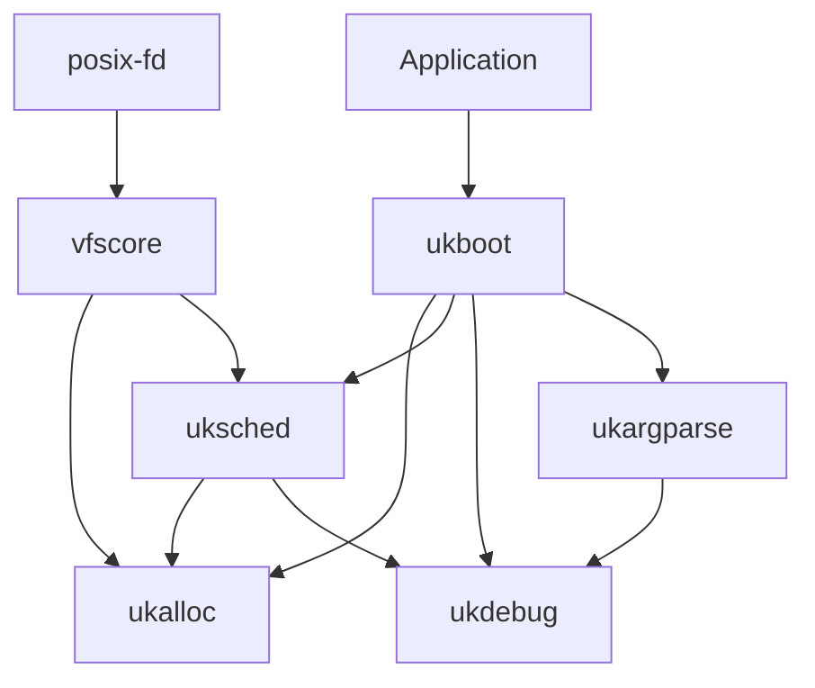

## Introduction

Unikraft's modular design is its defining characteristic. Unlike monolithic operating systems where components are tightly integrated, Unikraft is built as a **collection of composable libraries**. This design enables developers to include only the components their application needs, resulting in minimal, efficient, and secure unikernels.

<Info>
Unikraft includes **80+ internal libraries** that can be mixed and matched to create a custom operating system tailored to your application.
</Info>

## The Library-Based Approach

### What is a Unikraft Library?

A Unikraft library is a self-contained component that provides specific functionality. Each library:

<CardGroup cols={2}>
  <Card title="Self-Contained" icon="box">
    Has its own source code, configuration, and build rules
  </Card>
  <Card title="Composable" icon="puzzle-piece">
    Can depend on and interact with other libraries
  </Card>
  <Card title="Optional" icon="toggle-off">
    Can be included or excluded at build time
  </Card>
  <Card title="Configurable" icon="sliders">
    Offers fine-grained configuration options
  </Card>
</CardGroup>

### Library Structure

Every Unikraft library follows a consistent structure:

```
library-name/
├── Config.uk          # Kconfig configuration options
├── Makefile.uk        # Build rules and source files
├── exportsyms.uk      # Exported symbols (optional)
├── include/           # Public header files
│   └── uk/
│       └── library.h
└── src/              # Implementation files
    ├── main.c
    └── feature.c
```

<Accordion title="Example: Examining the ukalloc library structure">
```bash
lib/ukalloc/
├── Config.uk          # Configuration options
├── Makefile.uk        # Build instructions
├── exportsyms.uk      # uk_alloc, uk_free, etc.
├── include/
│   └── uk/
│       └── alloc.h    # Allocator API
└── alloc.c           # Implementation
```
</Accordion>

## The 80+ Internal Libraries

Unikraft's library ecosystem is organized into functional categories. Let's explore each category with real examples from the source code.

### Boot and System Initialization

<Tabs>
  <Tab title="ukboot">
    **Bootstrap Library** (`lib/ukboot`)
    
    The main entry point that orchestrates system initialization.
    
    ```kconfig
    menuconfig LIBUKBOOT
        bool "ukboot: Unikraft bootstrapping"
        select LIBNOLIBC if !HAVE_LIBC
        select LIBUKDEBUG
        select LIBUKARGPARSE
        select HAVE_BOOTENTRY
        default y
    ```
    
    Features:
    - Command-line argument parsing
    - Allocator initialization
    - Scheduler setup
    - Main thread creation
    - Banner display
    
    Configurable options:
    - Banner style (none, minimal, classic, UTF-8)
    - Allocator choice (binary buddy, region, mimalloc, tlsf)
    - Scheduler initialization
    - Main thread behavior
  </Tab>
  
  <Tab title="ukargparse">
    **Argument Parser** (`lib/ukargparse`)
    
    Parses command-line arguments and environment variables.
  </Tab>
  
  <Tab title="uklibid">
    **Library Identification** (`lib/uklibid`)
    
    Provides unique identifiers for each library at runtime.
  </Tab>
</Tabs>

### Memory Management

Unikraft offers multiple memory allocators, each optimized for different use cases:

<AccordionGroup>
  <Accordion title="ukalloc - Allocator API" icon="layer-group">
    Provides the abstract allocator interface that all allocators implement.
    
    ```c
    // Allocator API (simplified)
    void *uk_malloc(struct uk_alloc *a, size_t size);
    void uk_free(struct uk_alloc *a, void *ptr);
    void *uk_realloc(struct uk_alloc *a, void *ptr, size_t size);
    ```
  </Accordion>
  
  <Accordion title="ukallocbbuddy - Binary Buddy Allocator" icon="sitemap">
    **Default allocator** - Fast allocation with low fragmentation.
    
    From `lib/ukboot/Config.uk:102-104`:
    ```kconfig
    config LIBUKBOOT_INITBBUDDY
        bool "Binary buddy allocator"
        select LIBUKALLOCBBUDDY
    ```
    
    Characteristics:
    - Powers-of-two allocation sizes
    - Fast allocation and deallocation
    - Moderate memory overhead
    - Good for general-purpose workloads
  </Accordion>
  
  <Accordion title="ukallocregion - Region Allocator" icon="forward">
    **Bump allocator** - Fastest allocation, no deallocation.
    
    ```kconfig
    config LIBUKBOOT_INITREGION
        bool "Region allocator"
        select LIBUKALLOCREGION
        help
          Satisfy allocation as fast as possible. No support for free().
    ```
    
    Best for:
    - Short-lived applications
    - When objects are freed all at once
    - Minimal memory management overhead
  </Accordion>
  
  <Accordion title="ukallocpool - Pool Allocator" icon="th">
    Fixed-size object allocator for high-performance scenarios.
    
    Best for:
    - Frequent allocation/deallocation of same-sized objects
    - Network packet buffers
    - Thread control blocks
  </Accordion>
  
  <Accordion title="ukallocstack - Stack Allocator" icon="bars">
    Per-thread stack allocation with guard pages.
    
    From `lib/ukboot/Config.uk:239-242`:
    ```kconfig
    config LIBUKBOOT_ALLOCSTACK
        bool
        default y if LIBUKBOOT_INITALLOC
        select LIBUKALLOCSTACK
    ```
  </Accordion>
</AccordionGroup>

<Note>
You can mix allocators - use a pool allocator for specific objects while using buddy allocator for general allocations.
</Note>

### Virtual Memory Management

<CardGroup cols={2}>
  <Card title="ukvmem" icon="memory">
    Virtual memory management with paging support
  </Card>
  <Card title="ukmmap" icon="map">
    Memory mapping operations (mmap/munmap)
  </Card>
  <Card title="ukreloc" icon="arrows-alt">
    Position-independent binary support
  </Card>
  <Card title="uknofault" icon="shield-alt">
    No-fault memory access handling
  </Card>
</CardGroup>

### Scheduling and Concurrency

<Tabs>
  <Tab title="uksched">
    **Scheduler Abstraction** (`lib/uksched`)
    
    From `lib/uksched/Config.uk:1-7`:
    ```kconfig
    menuconfig LIBUKSCHED
        bool "uksched: Abstraction for schedulers"
        select LIBNOLIBC if !HAVE_LIBC
        select LIBUKDEBUG
        select LIBUKALLOC
        select HAVE_SCHED
    ```
    
    Provides:
    - Thread creation and management
    - Thread states (ready, running, blocked)
    - Sleep and yield operations
    - Thread-local storage
    - Optional statistics (lib/uksched/Config.uk:19-22)
  </Tab>
  
  <Tab title="ukschedcoop">
    **Cooperative Scheduler** (`lib/ukschedcoop`)
    
    Default scheduler implementation:
    - Non-preemptive scheduling
    - Explicit yield points
    - Low overhead
    - Predictable behavior
    
    Perfect for I/O-bound applications and event-driven architectures.
  </Tab>
  
  <Tab title="uklock">
    **Locking Primitives** (`lib/uklock`)
    
    Provides:
    - Mutexes
    - Semaphores
    - Reader-writer locks
    - Spinlocks
  </Tab>
</Tabs>

### File Systems

Unikraft supports multiple file system implementations through a unified VFS layer:

```
┌─────────────────────────────────────┐
│     POSIX File API (open, read)     │
├─────────────────────────────────────┤
│         vfscore (VFS Layer)         │
├─────────┬─────────┬─────────────────┤
│  ramfs  │  9pfs   │  virtiofs       │
│  devfs  │  ...    │                 │
└─────────┴─────────┴─────────────────┘
```

<AccordionGroup>
  <Accordion title="vfscore - Virtual File System" icon="layer-group">
    Core VFS implementation providing:
    - Mount point management
    - Path resolution
    - File descriptor management
    - Unified file operations
  </Accordion>
  
  <Accordion title="ramfs - RAM File System" icon="memory">
    In-memory file system:
    - Fast access (memory speed)
    - No persistence
    - Perfect for temporary files
    - `/tmp` directory implementation
  </Accordion>
  
  <Accordion title="9pfs - Plan 9 File System" icon="network-wired">
    Network file system for host integration:
    - Share directories with host
    - QEMU 9p protocol
    - Useful for development
  </Accordion>
  
  <Accordion title="devfs - Device File System" icon="plug">
    Device file system:
    - `/dev` directory
    - Device nodes (null, zero, random)
    - Character and block devices
  </Accordion>
  
  <Accordion title="virtiofs - VirtIO File System" icon="server">
    High-performance shared file system:
    - DAX (Direct Access) support
    - Better performance than 9pfs
    - FUSE-based host integration
  </Accordion>
</AccordionGroup>

### POSIX Compatibility Layer

Unikraft provides extensive POSIX compatibility through **modular libraries**. You can enable only the POSIX features your application needs:

<Tabs>
  <Tab title="Process Management">
    **posix-process** (`lib/posix-process`)
    - `fork()`, `exec()` family
    - `wait()`, `waitpid()`
    - Process IDs and hierarchy
    - Signal handling
  </Tab>
  
  <Tab title="File Descriptors">
    **posix-fd** (`lib/posix-fd`)
    - File descriptor abstraction
    
    **posix-fdtab** (`lib/posix-fdtab`)
    - File descriptor table
    - `dup()`, `dup2()`
    
    **posix-fdio** (`lib/posix-fdio`)
    - `read()`, `write()`, `close()`
    - I/O operations on file descriptors
  </Tab>
  
  <Tab title="IPC">
    **posix-pipe** (`lib/posix-pipe`)
    - `pipe()`, `pipe2()`
    
    **posix-socket** (`lib/posix-socket`)
    - Socket API
    - `socket()`, `bind()`, `listen()`, etc.
    
    **posix-unixsocket** (`lib/posix-unixsocket`)
    - Unix domain sockets
    
    **posix-netlink** (`lib/posix-netlink`)
    - Netlink sockets
  </Tab>
  
  <Tab title="Memory & Time">
    **posix-mmap** (`lib/posix-mmap`)
    - `mmap()`, `munmap()`
    - Memory mapping
    
    **posix-time** (`lib/posix-time`)
    - Time functions
    - `gettimeofday()`, `clock_gettime()`
    
    **posix-environ** (`lib/posix-environ`)
    - Environment variables
    - `getenv()`, `setenv()`
  </Tab>
</Tabs>

<Warning>
Enabling all POSIX libraries increases binary size. Only enable what your application uses.
</Warning>

### Networking

<CardGroup cols={2}>
  <Card title="uknetdev" icon="network-wired">
    Network device abstraction layer
    - TX/RX queue management
    - Device configuration
    - Statistics
  </Card>
  
  <Card title="posix-socket" icon="plug">
    POSIX socket API implementation
  </Card>
  
  <Card title="uk9p" icon="server">
    9P protocol implementation
  </Card>
  
  <Card title="posix-netlink" icon="link">
    Netlink socket support
  </Card>
</CardGroup>

### Device Support

<Tabs>
  <Tab title="Block Devices">
    **ukblkdev** (`lib/ukblkdev`)
    - Block device abstraction
    - Async I/O operations
    - Request queue management
  </Tab>
  
  <Tab title="Bus Support">
    **ukbus** (`lib/ukbus`)
    - Bus abstraction (PCI, platform)
    - Device discovery
    - Driver registration
  </Tab>
  
  <Tab title="Interrupt Controllers">
    **ukintctlr** (`lib/ukintctlr`)
    - Interrupt controller abstraction
    - GIC, APIC support
  </Tab>
  
  <Tab title="Console">
    **ukconsole** (`lib/ukconsole`)
    - Console abstraction
    - Multiple backend support
  </Tab>
</Tabs>

### C Library Support

<Tabs>
  <Tab title="nolibc">
    **Minimal C Library** (`lib/nolibc`)
    
    Lightweight C library providing:
    - Basic string functions (`memcpy`, `strlen`, etc.)
    - Math functions
    - Standard types
    - Minimal overhead
    
    <Info>
    nolibc is automatically selected if no external libc is provided.
    </Info>
  </Tab>
  
  <Tab title="External libc">
    Can integrate with:
    - **musl** - Full-featured POSIX libc
    - **newlib** - Embedded systems libc
    
    Detected via:
    ```kconfig
    config HAVE_LIBC
        bool
    ```
  </Tab>
</Tabs>

### Debugging and Development

<AccordionGroup>
  <Accordion title="ukdebug - Debug Support" icon="bug">
    Provides:
    - Debug output (`uk_pr_debug`, `uk_pr_info`, etc.)
    - Assertions (`UK_ASSERT`, `UK_BUGON`)
    - Stack traces
    - Debug levels
  </Accordion>
  
  <Accordion title="uktest - Testing Framework" icon="vial">
    Unit testing support:
    - Test case registration
    - Assertions
    - Test suites
    - Automatic test discovery
  </Accordion>
  
  <Accordion title="ukgcov - Code Coverage" icon="chart-line">
    GCC code coverage integration:
    - `.gcda` file generation
    - Coverage data export
  </Accordion>
  
  <Accordion title="ubsan - Undefined Behavior Sanitizer" icon="shield-alt">
    Runtime undefined behavior detection:
    - Integer overflow
    - Null pointer dereference
    - Out-of-bounds access
  </Accordion>
</AccordionGroup>

### Utility Libraries

<CardGroup cols={3}>
  <Card title="ukbitops" icon="binary">
    Bit manipulation operations
  </Card>
  <Card title="ukatomic" icon="atom">
    Atomic operations
  </Card>
  <Card title="ukring" icon="circle-notch">
    Ring buffer implementation
  </Card>
  <Card title="uksglist" icon="list">
    Scatter-gather lists
  </Card>
  <Card title="ukstreambuf" icon="stream">
    Stream buffers
  </Card>
  <Card title="uksparsebuf" icon="th-large">
    Sparse buffer management
  </Card>
</CardGroup>

## Library Dependencies

Libraries can depend on each other, forming a dependency graph:



### Dependency Types

<Tabs>
  <Tab title="select - Hard Dependency">
    ```kconfig
    config LIBUKBOOT
        bool "ukboot: Unikraft bootstrapping"
        select LIBUKDEBUG
        select LIBUKARGPARSE
    ```
    
    Automatically enables required libraries. User cannot disable them without disabling the parent.
  </Tab>
  
  <Tab title="depends on - Conditional Availability">
    ```kconfig
    config LIBUKBOOT_MAINTHREAD
        depends on LIBUKBOOT_INITSCHED && LIBUKBOOT_INITALLOC
    ```
    
    Option only available if dependencies are met.
  </Tab>
  
  <Tab title="imply - Soft Dependency">
    ```kconfig
    config LIBUKBOOT
        imply LIBUKBOOT_MAINTHREAD if HAVE_SHUTDOWN_DISPATCHER
    ```
    
    Suggests enabling a feature but allows user to disable it.
  </Tab>
</Tabs>

## Creating Custom Libraries

You can create external libraries and integrate them with Unikraft:

<Steps>
  <Step title="Create Library Structure">
    ```bash
    mylibrary/
    ├── Config.uk
    ├── Makefile.uk
    ├── include/uk/mylibrary.h
    └── mylibrary.c
    ```
  </Step>
  
  <Step title="Define Configuration">
    ```kconfig
    # Config.uk
    config LIBMYLIBRARY
        bool "mylibrary: My custom library"
        select LIBUKALLOC
        select LIBUKDEBUG
    ```
  </Step>
  
  <Step title="Add Build Rules">
    ```makefile
    # Makefile.uk
    $(eval $(call addlib,libmylibrary))
    
    LIBMYLIBRARY_SRCS-y += $(LIBMYLIBRARY_BASE)/mylibrary.c
    CINCLUDES-y += -I$(LIBMYLIBRARY_BASE)/include
    ```
  </Step>
  
  <Step title="Use in Build">
    ```bash
    make menuconfig L=/path/to/mylibrary
    # Enable "mylibrary" in Library Configuration
    make
    ```
  </Step>
</Steps>

## Library Registration

All 80+ internal libraries are registered in `lib/Makefile.uk`:

```makefile
# From lib/Makefile.uk:7-86
$(eval $(call import_lib,$(CONFIG_UK_BASE)/lib/9pfs))
$(eval $(call import_lib,$(CONFIG_UK_BASE)/lib/devfs))
$(eval $(call import_lib,$(CONFIG_UK_BASE)/lib/ukboot))
$(eval $(call import_lib,$(CONFIG_UK_BASE)/lib/ukalloc))
$(eval $(call import_lib,$(CONFIG_UK_BASE)/lib/uksched))
# ... 75 more libraries ...
```

The `import_lib` macro:
1. Sources the library's `Config.uk`
2. Includes the library's `Makefile.uk` if enabled
3. Registers exported symbols from `exportsyms.uk`

## Benefits of Modularity

<CardGroup cols={2}>
  <Card title="Minimal Footprint" icon="compress">
    Include only what you need - resulting binaries can be under 1MB
  </Card>
  
  <Card title="Reduced Attack Surface" icon="shield">
    Fewer components mean fewer potential vulnerabilities
  </Card>
  
  <Card title="Better Performance" icon="rocket">
    Less code to execute and smaller code size improves cache utilization
  </Card>
  
  <Card title="Easier Maintenance" icon="wrench">
    Clear boundaries between components simplify debugging and updates
  </Card>
  
  <Card title="Flexibility" icon="sliders">
    Swap components based on requirements (e.g., different allocators)
  </Card>
  
  <Card title="Reusability" icon="recycle">
    Libraries can be reused across different applications
  </Card>
</CardGroup>

## Best Practices

<AccordionGroup>
  <Accordion title="Start Minimal">
    Begin with the minimum set of libraries and add only what you need:
    
    ```kconfig
    # Minimal configuration
    CONFIG_LIBUKBOOT=y
    CONFIG_LIBUKALLOC=y
    CONFIG_LIBNOLIBC=y
    ```
  </Accordion>
  
  <Accordion title="Profile Library Usage">
    Use `make print-libs` to see which libraries are enabled:
    
    ```bash
    $ make print-libs
    ukboot ukalloc ukdebug uksched vfscore posix-fd ...
    ```
  </Accordion>
  
  <Accordion title="Understand Dependencies">
    Check library dependencies before enabling:
    
    ```bash
    # View library source files
    make print-srcs
    
    # View library objects
    make print-objs
    ```
  </Accordion>
  
  <Accordion title="Use Feature Flags">
    Many libraries offer fine-grained feature control. Review `Config.uk` options for each library.
  </Accordion>
</AccordionGroup>

## Next Steps

<Card title="Build System" icon="hammer" href="/concepts/build-system">
  Learn how the Kconfig and Makefile system brings these libraries together
</Card>